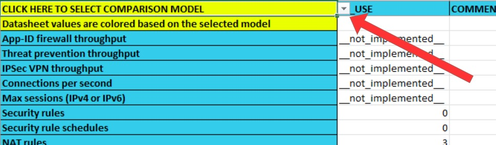
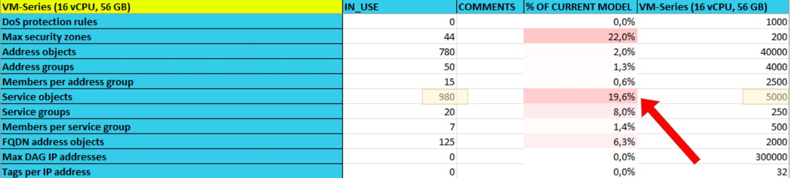

# Palo Alto NGFW Resource Analyzer and Datasheet Comparison

This script:

1. Downloads the [datasheets](https://www.paloaltonetworks.com/products/product-comparison)
2. Contacts a Palo Alto Networks firewall over the XML API
3. Runs a series of "show" commands and extracts information from the firewall configuration
4. Outputs an Excel document in which the actual usage for every datasheet metric is listed for the firewall, and compared to the maximum for all NGFW models

The Excel file makes use of conditional formatting to quickly point out metrics where the current usage is close to, or exceeds, the maximum for the current platform.

It also allows comparing the current resource usage with other models as well as datasheet values between different models.

This reduces (but far from negates) the amount of manual work required to properly size hardware refresh projects as well as firewall health checks.

**After generating the Excel file, select your current firewall model (or any model you are planning to replace it with) to see the % of total capacity that would be consumed.**



**The % is highlighted in shades of red the closer it gets to 100%.**



**The datasheet values themselves are also compared between the selected model (left) and all other models, coded in blue for a same value, red for a worse value, and green for a better one.**


### Usage

```
usage: main.py [-h] [-k] [-p] [-x {DEBUG,INFO,WARNING,ERROR,CRITICAL}] firewall api_key

Get data from a Palo Alto PanOS firewall and compare it with its published limits from their website

positional arguments:
  firewall              Firewall IP address or hostname
  api_key               A valid API key with read privileges for the device.

options:
  -h, --help            show this help message and exit
  -k, --ignore-certs    Don't check for valid certificates when connecting to firewalls. Default: Validate
                        certificates
  -p, --print-results   Print details of the overrides to terminal instead of outputting to file. Default: False
  -x {DEBUG,INFO,WARNING,ERROR,CRITICAL}, --debug-level {DEBUG,INFO,WARNING,ERROR,CRITICAL}
                        Logging message verbosity. Default: WARNING
```
```
Example:

  $ python3 main.py 192.0.2.1 ==APIKEY123
```

The script has been tested with PanOS 10.2, 11.1.

### Requirements

- [pint](https://pypi.org/project/Pint/) (install with ```pip3 install pint```)
- [xlsxwriter](https://pypi.org/project/XlsxWriter/) (install with ```pip3 install xlsxwriter```)
- [requests](https://pypi.org/project/requests/) (install with ```pip3 install requests```)
- [lxml](https://pypi.org/project/lxml/) (install with ```pip3 install lxml```)

### License

This project is licensed under the [Apache-2.0 license](LICENSE).
